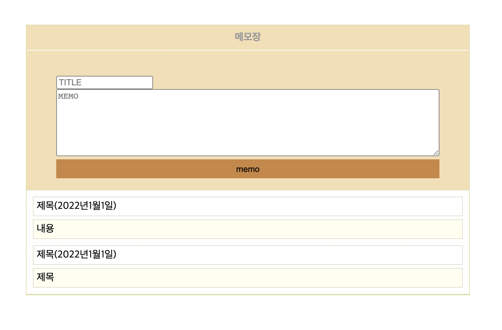

github 링크 :https://yoojin-park19.github.io/node_memo/

<br>

# 1. 작품의 목적

## 1.1 기획 의도

* 편리하게 메모를 작성하고 기록을 남기기위해 제작 되었습니다.

## 1.2 주 목적

* 기록 작성
* 기록 저장

<br>

# 2. 작품 요약

## 2.1 내용 및 주요 기능

* 메모를 저장할 수 있다.
* 메모를 기록할 수 있다.


## 2.2 기대효과

<br>

# 3. 작품 제작 과정

## 3.1 제작 기간 및 역할분담

* 개인 프로젝트
* 제작 기간: 12/31 ~ 1/1 (2일 소요)


### 3.1.1 제작 기간

아이디어 구상 및 데이터 확보: 약 하루정도 소요

전처리: 약 하루 정도 소요


## 3.2 데이터 전처리

````
let load = null;
let write = null;
$(document).ready(function () {
	load = function () {
		$.get('/load', function (data){
			$("#memo").empty();
			
			$(data).each(function (i){ 
				let id = this._id;
				$("#memo").prepend("<div class='item'></div>");
				$("#memo .item:first").append("<div class='author'>" + this.author + "(" + this.date+ ")");
				$("#memo .item:first").append("<div class='contents " + id + "'>" + this.contents + div>")
				});
		});
	};

	write = function(contents) {
		var postdata = {
			'author': $("#author").val(),
			'contents': contents
		};
		$.post('/write', postdata, function() {
			load();
		});
	
	$("#write_button").click(function(evt){  // 쓰기 버튼을 클릭했을 때
		write($("#write textarea").val());
		$("#write textarea").val("");
        $("#author").val("");
	});
	load();
});
````

# 4. 작품에 사용된 도구

## 4.1 언어 및 라이브러리

ejs, express, node.js, mongodb, jquery


# 5. 제작결과


<br>
# 6. 피드백
