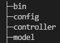
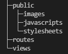
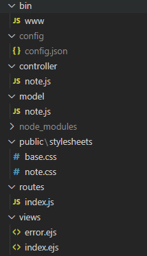
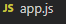
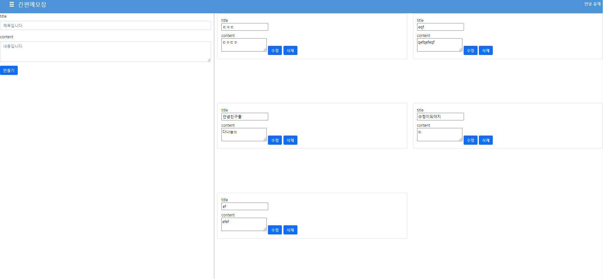
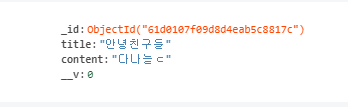

# web_note
## pakage
- express / express-generator
- mongoose
## path
<br/>
<br/>
## path2
<br/>
<br/>
## 기능
- CRUD
```js
const Ctr= {
    create: async (req, res)=> {
        const {title, content} = req.body;
        const note = new Note({
            title: title,
            content: content
        });
        try {
            await note.save();
            res.redirect('/');
        } catch (error) {
            res.status(500).send("create error");
        }
    },

    read: async (req, res)=> {
        const notes = await Note.find({});
        res.render("index",{note: notes});
    },

    update: async (req, res)=> {
        const {id} = req.params;
        const {title, content} = req.body;
        try{
            await Note.findByIdAndUpdate(id,
                { 
                    title:title,
                    content:content
                },
                {new: true});
            res.redirect('/');
        } catch(error){
            res.status(500).send("update error");
        } 
    },
    delete: async (req,res)=> {
        const {id} = req.params;
        try{
            await Note.findByIdAndDelete(id);
            res.redirect('/');
        } catch(error) {
            res.status(500).send("delete error");
        }
    }
}
```
## 탬플릿

[참고](https://github.com/bbarksse/noteApp)
## Schema

```json
{
    "title":"String",
    "content":"String"
}
```